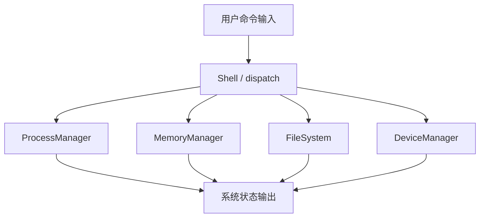
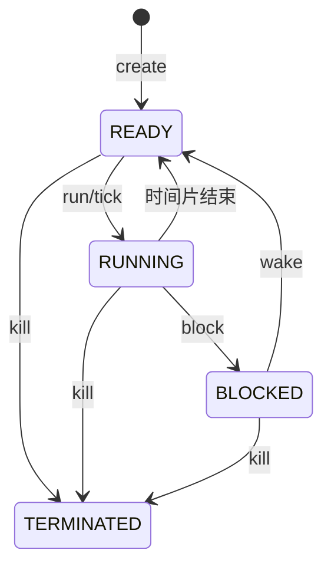
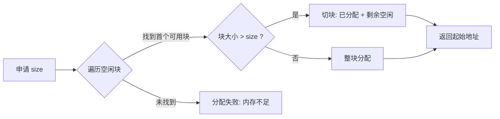
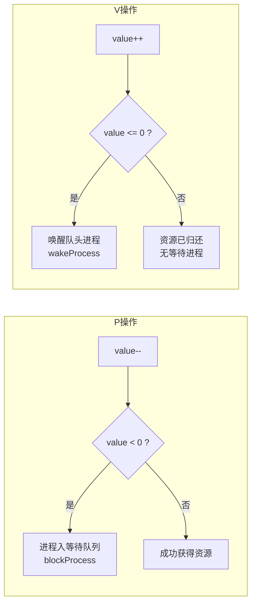
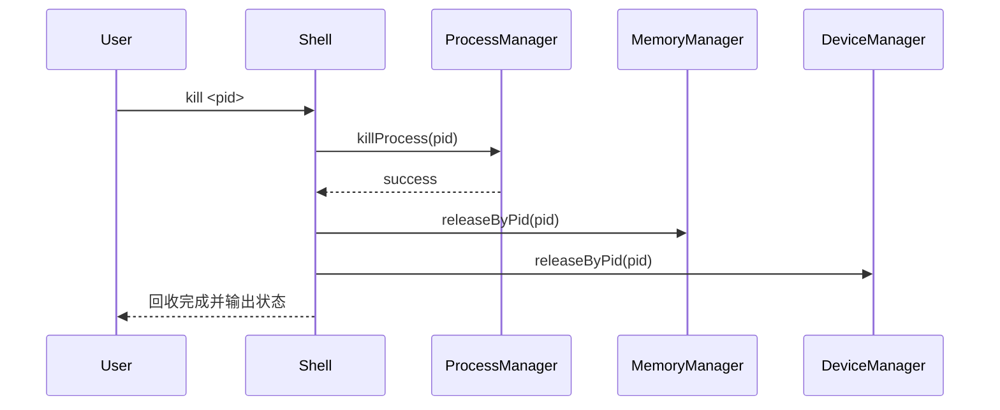

# Yinix 操作系统模拟器（答辩展示文档）

## 项目概述

Yinix 是一个基于 C++17 实现的操作系统教学模拟器。项目通过统一的命令行 Shell，组织并驱动四类核心管理功能：进程管理、内存管理、文件系统管理、设备管理。  
系统采用用户态数据结构模拟，重点体现资源申请、调度、回收与模块联动机制，便于课程展示与原理验证。

## 主要特性

- 交互式 Shell：支持命令解析、错误提示、历史命令。
- 进程管理：支持创建、阻塞、唤醒、终止与时间片轮转调度。
- 内存管理：基于 First Fit 的分配策略与相邻空闲块合并。
- 文件系统：基于目录树的文件/目录管理与会话持久化。
- 设备管理：支持独占设备分配、释放与按进程批量回收。
- 进程同步/互斥：基于 PV 信号量，支持进程阻塞/唤醒与资源互斥访问。
- 资源联动：进程终止时自动释放其占用内存与设备。

## 系统架构



## 模块设计说明

### 1) 进程管理

- 核心数据：`PCB`（PID、名称、状态、优先级、CPU 时间）。
- 关键结构：`map<int, PCB>` 进程表、`queue<int>` 就绪队列、`runningPid` 当前运行进程。
- 调度策略：Round Robin（手动 `run` 触发一次 `tick()`）。
- 当前模型：单 CPU 槽位模拟（同一时刻仅 1 个 RUNNING 进程）。

#### 进程状态转换图



### 2) 内存管理

- 核心数据：`MemBlock { start, size, free, ownerPid }`。
- 空间组织：`list<MemBlock>` 维护有序分区。
- 分配策略：First Fit（首次适配，必要时切块）。
- 回收策略：按起始地址释放，随后执行 `merge()` 合并相邻空闲块。

#### 内存分配流程（First Fit）



### 3) 文件系统

- 核心数据：`FSNode` 目录树（目录/文件、父子关系、内容、时间）。
- 目录上下文：`root` 与 `cwd`。
- 支持命令：`pwd`、`ls`、`cd`、`mkdir`、`touch`、`write`、`cat`、`rm`。
- 持久化：交互模式下启动 `load()`、退出 `save()`。
- 默认落盘路径：`~/osProj/data/yinix_fs.dat`。

### 4) 设备管理

- 预置设备：`printer0`、`disk0`、`disk1`、`keyboard0`、`screen0`。
- 分配策略：独占分配，BUSY 时拒绝重复申请。
- 回收策略：支持按设备名释放、按进程 PID 批量释放。

### 5) 进程同步与互斥（PV 信号量）

- 核心数据：`Semaphore { id, name, value, waitQueue }`，由 `SyncManager` 统一管理。
- `SyncManager` 持有 `ProcessManager` 引用，P/V 操作直接完成进程阻塞与唤醒。
- **P 操作（申请资源）**：`value--`；若 `value < 0`，进程入 FIFO 等待队列并调用 `blockProcess()` 阻塞。
- **V 操作（释放资源）**：`value++`；若 `value ≤ 0`，取等待队列队头，调用 `wakeProcess()` 唤醒。

| `value` 取值 | 含义 |
|---|---|
| `> 0` | 尚有 value 个可用资源 |
| `= 0` | 资源恰好耗尽，无进程等待 |
| `< 0` | 共有 \|value\| 个进程在等待队列中阻塞 |

#### PV 操作流程



## 关键联动流程

### 进程终止触发资源回收



说明：该流程保证进程退出后资源一致性，避免内存块和设备占用泄漏。

## 构建与运行

```bash
cmake -B build && cmake --build build
./build/yinix
```

## 演示命令（建议顺序）

```bash
# 进程
create init 10
create bash 5
ps
run
run

# 内存 + 设备
malloc 256 1
alloc printer0 1
memmap
devices

# 联动回收
kill 1
memmap
devices

# 同步/互斥（互斥锁异步展示）
sem_create mutex 1
create w1
create w2
sem_p mutex 1
sem_list
sem_p mutex 2
ps
sem_v mutex
ps

# 文件系统
mkdir home
cd home
touch note.txt
write note.txt hello_yinix
cat note.txt
exit
```

## 代码定位

- 入口与主循环：`src/main.cpp`、`src/shell/Shell.cpp`
- 进程调度：`src/process/ProcessManager.cpp`（`tick()`）
- 内存分配与合并：`src/memory/MemoryManager.cpp`（`allocate()`、`merge()`）
- 文件系统持久化：`src/filesystem/FileSystem.cpp`（`save()`、`load()`）
- 设备分配与释放：`src/device/DeviceManager.cpp`
- 资源联动入口：`src/shell/Shell.cpp`（`handleProc()` 的 `kill` 分支）
- PV 信号量：`src/process/SyncManager.cpp`（`P()`、`V()`）

## 设计取舍与后续扩展

### 当前取舍

- 采用单线程、单 CPU 模拟，优先保证逻辑可解释性。
- 文件系统使用教学友好的内存树结构，而非完整磁盘块模型。
- 设备管理采用静态设备池，突出分配/回收流程。
- 同步/互斥采用经典 PV 信号量，直接复用现有阻塞/唤醒机制。

### 可扩展方向

- 多 CPU 调度与更复杂调度算法。
- 页式内存、虚拟内存与缺页处理模拟。
- 文件权限、路径解析增强与日志恢复。
- 设备等待队列与中断驱动模型。

## 总结

Yinix 已形成“命令驱动 + 四大模块 + 资源联动”的完整教学闭环。该实现具备结构清晰、功能可演示、结果可验证的特点，能够较好支撑课程设计答辩中的原理说明与现场展示。
